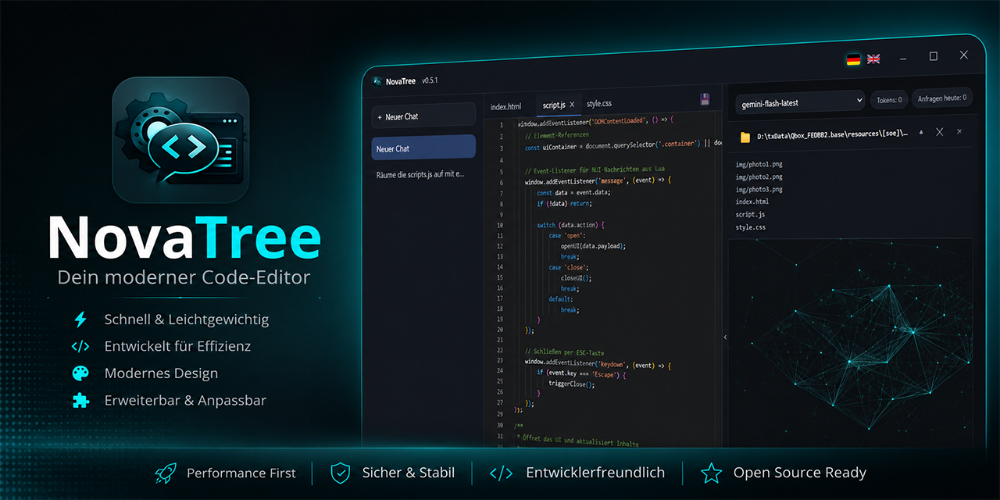

# NovaTree

Desktop-Chat-Client (Windows/Linux) für die Google Gemini API, gebaut mit [Tauri](https://tauri.app) 2
(Rust-Backend + Vanilla TypeScript-Frontend).

---

### ⚠️ WICHTIGER RECHTLICHER HINWEIS / DISCLAIMER

**Deutsch:**
Diese Software wird "wie besehen" (AS IS) und ohne jegliche Gewährleistung oder Garantie bereitgestellt. Da NovaTree im "Workspace-Modus" autonom Dateien auf Ihrer Festplatte erstellen, bearbeiten oder löschen kann, erfolgt die Nutzung komplett auf eigene Gefahr. Die Entwickler übernehmen keinerlei Haftung für Datenverlust, Systemschäden, Fehlfunktionen oder daraus resultierende Folgeschäden. Mit der Nutzung der App erklären Sie sich mit diesem Haftungsausschluss einverstanden.

**English:**
This software is provided "as is" without warranty of any kind. Since NovaTree is capable of autonomously creating, editing, or deleting files on your local drive in "Workspace Mode", you use this software entirely at your own risk. The developers shall not be held liable for any data loss, system damage, malfunctions, or consequential damages. By using this app, you agree to this disclaimer.

---

**Hinweis (v0.6.0):** Die App hieß bis v0.5.1 „NovaTwin" und wurde aus Markenrechtsgründen in „NovaTree" umbenannt... 

> **Hinweis (v0.6.0):** Die App hieß bis v0.5.1 „NovaTwin" und wurde aus Markenrechtsgründen in
> „NovaTree" umbenannt (App-Identifier, Repo, Datenablage). Wer eine ältere Version installiert
> hatte: Chats/Einstellungen werden **nicht automatisch übernommen** (neue App-ID = neuer
> Datenpfad) und der Google-API-Schlüssel muss einmalig neu in den Einstellungen eingetragen
> werden (neuer Schlüsselbund-Eintrag).

> [!IMPORTANT]
> **🛡️ Wichtiger Hinweis für Windows-Nutzer ("Computer wurde geschützt"):**
> <br>Da NovaTree ein unabhängiges Open-Source-Projekt ist und nicht kostenpflichtig digital signiert wurde, zeigt Windows SmartScreen beim ersten Start die Warnung *"Der Computer wurde durch Windows geschützt"* an.
> 
> Die App ist zu 100 % sicher! Du kannst die Meldung einfach überspringen:
> 1. Klicke im blauen Fenster auf **"Weitere Informationen"**.
> 2. Klicke unten rechts auf den Button **"Trotzdem ausführen"**.
> 
> Da der gesamte Quellcode hier offenliegt, kann sich jeder selbst davon überzeugen, dass keine Schadsoftware enthalten ist. Sobald genügend Nutzer die App starten, lernt Windows automatisch, dass sie sicher ist, und die Meldung verschwindet von selbst!


## Features

- Eigene, ins Design integrierte Titelleiste (keine native OS-Titelleiste) mit Versionsanzeige
- Sidebar mit Chat-Verlauf, "Neuer Chat"-Button und Einstellungen
- Modell-Auswahl pro Chat (`gemini-flash-latest`, `gemini-3.1-flash-lite`; `gemini-2.5-pro` ist im
  Free Tier ausgegraut, da Google dafür Kontingent 0 vergibt)
- Token- und Tageskontingent-Anzeige (Free-Tier-Limit: 1000 Anfragen/Tag, 15/Minute) inkl.
  automatischem Cooldown-Timer bei HTTP-429-Antworten (Quota exceeded)
- Datei-Anhang (Büroklammer) zum Einlesen lokaler Dateien (z. B. `.lua`, `.py`) als Kontext
- "Datei aktualisieren"-Button, um von Gemini editierten Code direkt auf die Festplatte zurückzuschreiben
- **Workspace-Ordner pro Chat**: lokalen Projektordner verknüpfen, Gemini sieht die vorhandene
  Dateistruktur und kann per striktem JSON-Protokoll autonom Dateien darin erstellen, bearbeiten
  oder löschen (siehe unten)
- API-Schlüssel wird **nicht** im Code oder als Klartext gespeichert, sondern im
  OS-Schlüsselbund (Windows Credential Manager / Linux Secret Service via `keyring`-Crate)
- Automatisches Update: Beim Start prüft die App den neuesten GitHub-Release; ist eine neuere,
  signierte Version verfügbar, erscheint ein Banner zum Herunterladen/Installieren + Neustart

### Workspace-Ordner

Über das 📁-Icon im Chat-Header lässt sich pro Chat ein lokaler Ordner verknüpfen. Vor jeder
Anfrage liest die App die aktuelle Dateiliste des Ordners (rekursiv, `node_modules`/`.git`/
`target`/… werden übersprungen) und hängt sie an den System-Prompt an. Antwortet Gemini mit
einem JSON-Objekt der Form

```json
{ "action": "create|edit|delete", "filename": "relativer/pfad.lua", "content": "…" }
```

führt die App die Aktion direkt über eigene Rust-Commands aus (kein `tauri-plugin-fs` mit
`scope: ["**"]` nötig) und zeigt statt des Roh-JSON eine kurze Statuszeile an. Dateinamen mit
`..`-Traversal oder absoluten Pfaden werden serverseitig abgelehnt, sodass Aktionen nicht aus
dem gewählten Ordner ausbrechen können.

### KI-Dateizugriff (Freigabe-Modi)

Unter Einstellungen → **„KI-Dateizugriff"** lässt sich steuern, ob NovaTree Datei-Aktionen im
Workspace-Ordner sofort ausführt oder erst deine Bestätigung braucht:

- **Immer nachfragen** – jede Aktion (create/edit/delete) muss bestätigt werden.
- **Teil-Autonom** – einzeln pro Aktionstyp konfigurierbar (Standard: Erstellen automatisch,
  Bearbeiten/Löschen mit Nachfrage).
- **Voll-Autonom** – NovaTree schreibt ohne Rückfrage direkt durch.

Bei **Löschen** erscheint eine rote Warnung mit Dateipfad, bei **Erstellen/Bearbeiten** ein
Diff-Ansicht (Monacos nativer `createDiffEditor()`) zwischen aktuellem und vorgeschlagenem
Inhalt, in einem eigenständigen Modal – unabhängig davon, ob der Live-Editor gerade sichtbar ist.

### Präzise Bearbeitung, Architect Mode, Bild-Anhänge (ab v0.8.0)

- **Präzise Edits:** Bestehende Dateien werden nicht mehr komplett überschrieben, sondern per
  Suchen/Ersetzen-Paaren geändert (`{"search": "...", "replace": "..."}`). Trifft ein `search`
  nur nach Whitespace-Normalisierung oder gar nicht, wird nichts geschrieben und stattdessen ein
  Hinweis angezeigt, statt riskant zu raten.
- **Architect Mode:** Für komplett neue Projekte/Ressourcen mit mehreren Dateien liefert Gemini
  ein `createProject`-Objekt (Zielordner + Dateien), die App legt Ordner und Dateien in einem
  Zug an – inklusive einer konsolidierten Freigabe-Ansicht (Dateiliste statt Einzel-Diffs).
- **Bild-Anhänge:** Bilder lassen sich per Strg+V oder Drag & Drop ins Chat-Eingabefeld anhängen;
  sie werden clientseitig auf max. 1024px Breite herunterskaliert und als JPEG komprimiert, bevor
  sie als Teil der Anfrage an Gemini gesendet werden.
- **JSON-Reparatur:** Wird eine Antwort mitten im JSON abgeschnitten (Ausgabe-Limit erreicht),
  versucht die App automatisch, offene Strings/Klammern zu schließen, bevor sie aufgibt – statt
  das kaputte Roh-JSON als Chat-Text anzuzeigen.

## Entwicklung

Voraussetzungen: [Node.js](https://nodejs.org), [Rust](https://www.rust-lang.org/tools/install) und die
[Tauri-Systemabhängigkeiten](https://tauri.app/start/prerequisites/) für dein Betriebssystem.

```bash
npm install
npm run tauri dev
```

## Produktions-Build (lokal)

```bash
npm run tauri build
```

## Automatischer Release via GitHub Actions

Bei jedem Push auf `main` baut `.github/workflows/release.yml` über eine Matrix-Strategie
(`windows-latest`, `ubuntu-22.04`) mittels `tauri-apps/tauri-action` automatisch:

- Windows: `.exe` (NSIS) / `.msi`
- Linux: `.AppImage` / `.deb` / `.rpm`

Zusätzlich baut ein zweiter Job (`flatpak-bundle`) im Anschluss ein `NovaTree.flatpak` gegen die
`org.gnome.Platform`-Runtime (bringt eine feste, getestete WebKitGTK-Version mit statt der des
Host-Systems – behebt Rendering-Probleme wie `EGL_BAD_PARAMETER`, die auf manchen Distros mit
sehr aktuellem Mesa/WebKitGTK auftreten, z. B. bei AppImages, die WebKitGTK nicht mitbündeln).
Installation: `.flatpak`-Datei herunterladen, dann `flatpak install NovaTree.flatpak` bzw. per
Doppelklick, falls die Dateimanager-Integration vorhanden ist.

Die fertigen Installer werden automatisch als **veröffentlichter Release** (nicht als Draft)
unter "Releases" im Repository abgelegt – nur ein veröffentlichter Release ist über den
`/releases/latest/download/...`-Endpunkt erreichbar, den der Auto-Updater abfragt.

Vor der ersten Nutzung: Repository (und ggf. die Organisation) unter
`Settings → Actions → General → Workflow permissions` auf "Read and write permissions" stellen,
damit der Workflow Releases erstellen darf.

### Auto-Updater

Die App prüft bei jedem Start `https://github.com/State-of-Economy/NovaTree/releases/latest/download/latest.json`.
Ist die dort verzeichnete Version neuer als die installierte, erscheint ein Update-Banner.
Damit ein neuer Push tatsächlich ein Update auslöst, **muss die Versionsnummer** in
`src-tauri/tauri.conf.json` (Feld `version`) und `package.json` vor dem Push erhöht werden –
sonst versucht die Pipeline, denselben Release-Tag erneut anzulegen, was fehlschlägt.

Updates werden mit einem lokal erzeugten Minisign-Schlüsselpaar signiert:

- **Public Key** liegt in `src-tauri/tauri.conf.json` (`plugins.updater.pubkey`) – öffentlich, unkritisch.
- **Private Key** liegt **nicht** im Repository, sondern als verschlüsseltes GitHub-Secret
  `TAURI_SIGNING_PRIVATE_KEY` (Passwort in `TAURI_SIGNING_PRIVATE_KEY_PASSWORD`).
  **Wichtig:** Diesen privaten Schlüssel sicher aufbewahren (z. B. Passwortmanager) – geht er
  verloren, können keine weiteren signierten Updates mehr veröffentlicht werden und bestehende
  Installationen lassen sich nicht mehr automatisch aktualisieren.

## Bekannte Linux-Probleme

**Fenster bleibt komplett weiß/schwarz:** Ein häufiger WebKitGTK-Bug auf manchen Linux-Systemen
(VMs, bestimmte Mesa/GPU-Treiber, einige Wayland-Setups). Ab v0.3.1 setzt die App automatisch
`WEBKIT_DISABLE_COMPOSITING_MODE=1` und `WEBKIT_DISABLE_DMABUF_RENDERER=1` beim Start, was das
Problem in den meisten Fällen behebt. Tritt es trotzdem noch auf, testweise manuell setzen:

```bash
WEBKIT_DISABLE_COMPOSITING_MODE=1 WEBKIT_DISABLE_DMABUF_RENDERER=1 ./NovaTree_*.AppImage
```

**Flatpak: weißes Fenster mit "could not connect to localhost":** WebKitGTKs eigene interne
(bubblewrap-)Sandbox, verschachtelt in Flatpaks Sandbox, blockiert die localhost-Verbindung, über
die Tauri intern die App-Assets ausliefert. Ab v0.3.6 setzt das Flatpak-Manifest dafür
`WEBKIT_FORCE_SANDBOX=0`. Ab v0.3.7 zusätzlich `runtime-version: '50'` statt `'47'` – ein
unabhängig getesteter Community-Build (PR #1) lief bereits ohne den Env-Var-Fix stabil, nur mit
der neueren Runtime-Version, was nahelegt, dass der zugrunde liegende Bug in neueren
`org.gnome.Platform`-Versionen bereits upstream behoben ist. Beide Fixes bleiben aus
Sicherheitsgründen kombiniert bestehen.

## API-Schlüssel einrichten

1. App starten, unten links auf **Einstellungen** klicken.
2. Auf **„API-Schlüssel holen"** klicken – öffnet Google AI Studio im Standard-Browser.
3. Optional: System-Prompt und Sicherheitsfilter anpassen.
4. Speichern – der Schlüssel wird verschlüsselt im OS-Schlüsselbund abgelegt, niemals im Klartext
   in einer Konfigurationsdatei oder im Quellcode.

### 💡 Tipps zur Einrichtung

- **Smarter Import:** Sobald du auf Google AI Studio einen Schlüssel generierst und kopierst,
  erkennt NovaTree ihn automatisch aus der Zwischenablage und trägt ihn direkt im
  Einstellungsfenster ein (nur während das Fenster offen ist – kein Hintergrund-Polling).
- **VPN-Problem:** Zeigt die Google-Seite „Not available in your region“, schalte für das
  Generieren des Schlüssels kurz dein VPN aus. Google blockiert Rechenzentrum-IPs von
  VPN-Anbietern sehr aggressiv, um Bot-Registrierungen zu verhindern. Nach dem Kopieren des
  Schlüssels kannst du dein VPN sofort wieder aktivieren.

## Lizenz

Dieses Projekt steht unter der [GNU General Public License v3.0](LICENSE). Wer den Quellcode
kopiert oder verändert, muss sein eigenes Werk ebenfalls vollständig quelloffen und unter GPLv3
weitergeben – ein geschlossener, kommerzieller Weiterverkauf ist damit ausgeschlossen.
